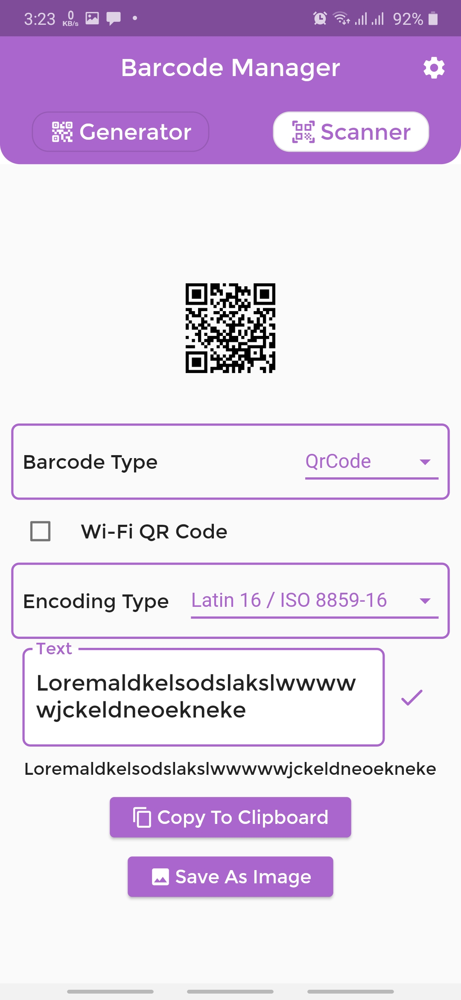
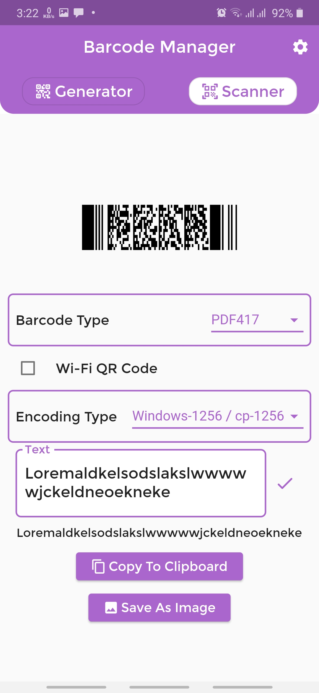
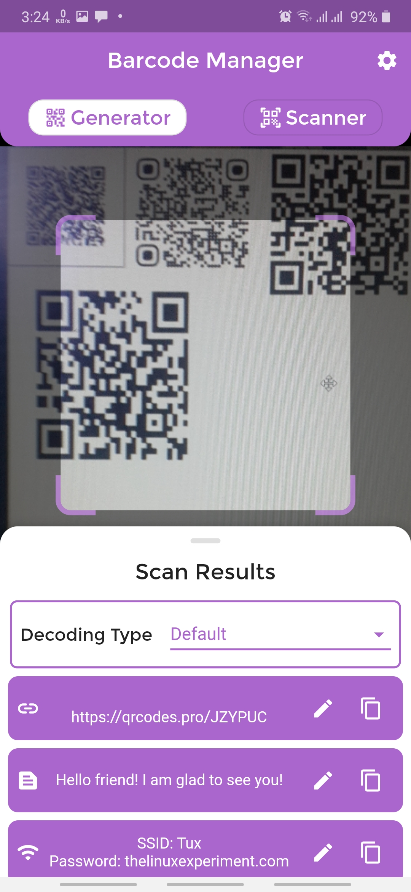

# Barcode-Manager-Flutter
 

A flutter application that supports all the barcode services (Scan - Generate) with all barcode types and the ability to customize the encoding and decoding formats.

#### Compatible with **Android, IOS, Web, Windows, MacOS** platforms.

### Features 🚀
- Support multiple language **(Arabic - English)**.
- Scan & Generate barcodes with all types.
- Encode the text which by will generate a barcode in multiple formats.
- Decode the text which will converted from the barcode after the Scan operation in multiple formats.
- Generate Wi-Fi QR Code from SSID and Password.
- Detect the scanned barcode production type and support many production types. 
- Support scanning multiple barcodes in the same time.
- Scan barcodes from a picked image from the gallery.

## Functional Description
- [enough_convert](https://pub.dev/packages/enough_convert) is used for codec types.
- Scan the barcodes by [mobile_scanner](https://pub.dev/packages/mobile_scanner) and scan from an image by [scan](https://pub.dev/packages/scan).
- [barcode](https://pub.dev/packages/barcode) is used for generate barcodes.

## Screenshots 🎉

Generate QR Code   |  Generate PDF417 Barcode   |  Generate Wi-Fi QR   |  Scan Multiple Barcodes
:-------------------------:|:-------------------------:|:-------------------------:|:-------------------------:
  |    |    |  

## The Used Codec Formats
- UTF-8
- ASCII
- Latin 1 / ISO 8859-1
- Latin 2 / ISO 8859-2
- Latin 3 / ISO 8859-3
- Latin 4 / ISO 8859-4
- Latin 5 / ISO 8859-5
- Latin 6 / ISO 8859-6
- Latin 7 / ISO 8859-7
- Latin 8 / ISO 8859-8
- Latin 9 / ISO 8859-9
- Latin 10 / ISO 8859-10
- Latin 11 / ISO 8859-11
- Latin 13 / ISO 8859-13
- Latin 14 / ISO 8859-14
- Latin 15 / ISO 8859-15
- Latin 16 / ISO 8859-16
- Windows-1250 / cp-1250
- Windows-1251 / cp-1251
- Windows-1252 / cp-1252
- Windows-1253 / cp-1253
- Windows-1254 / cp-1254
- Windows-1256 / cp-1256
- cp-850
- GBK (compatible with GB-2312)
- KOI8
- KOI8-R
- KOI8-U
- Big5

## The Used Barcode Types
- Code 39
- Code 93
- Code 128 A
- Code 128 B
- Code 128 Cs
- GS1-128
- ITF
- ITF 14
- ITF-16
- EAN 13
- EAN 8
- EAN 2
- EAN 5
- ISBN
- UPC-A
- UPC-E
- Telepen
- Codabar
- RM4SCC
- QR-Code
- PDF417
- Data Matrix
- Aztec
